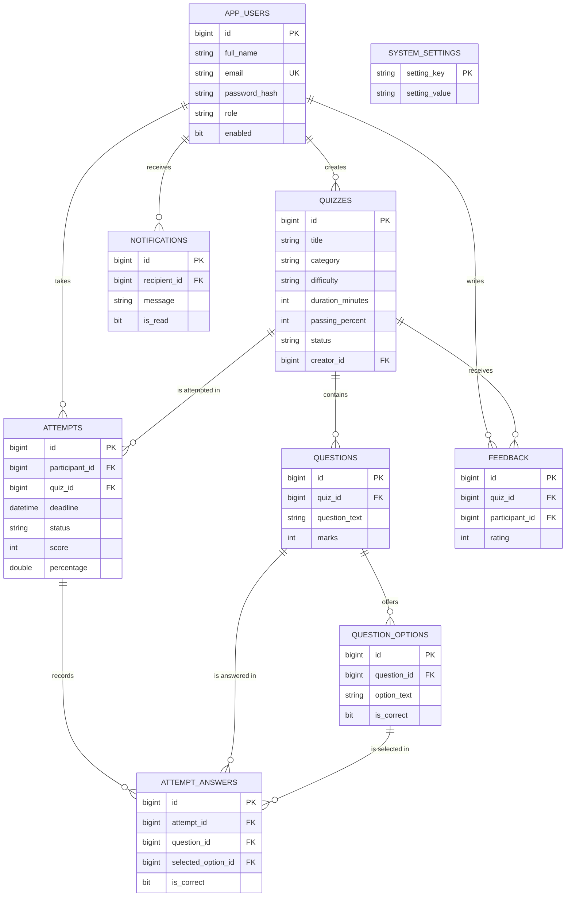

# ER diagram

```mermaid
erDiagram
    APP_USERS ||--o{ QUIZZES : creates
    QUIZZES ||--o{ QUESTIONS : contains
    QUESTIONS ||--o{ QUESTION_OPTIONS : offers
    APP_USERS ||--o{ ATTEMPTS : takes
    QUIZZES ||--o{ ATTEMPTS : "is attempted in"
    ATTEMPTS ||--o{ ATTEMPT_ANSWERS : records
    QUESTIONS ||--o{ ATTEMPT_ANSWERS : "is answered in"
    QUESTION_OPTIONS ||--o{ ATTEMPT_ANSWERS : "is selected in"
    APP_USERS ||--o{ FEEDBACK : writes
    QUIZZES ||--o{ FEEDBACK : receives
    APP_USERS ||--o{ NOTIFICATIONS : receives

    APP_USERS {
        bigint id PK
        string full_name
        string email UK
        string password_hash
        string role
        bit enabled
    }
    QUIZZES {
        bigint id PK
        string title
        string category
        string difficulty
        int duration_minutes
        int passing_percent
        string status
        bigint creator_id FK
    }
    QUESTIONS {
        bigint id PK
        bigint quiz_id FK
        string question_text
        int marks
    }
    QUESTION_OPTIONS {
        bigint id PK
        bigint question_id FK
        string option_text
        bit is_correct
    }
    ATTEMPTS {
        bigint id PK
        bigint participant_id FK
        bigint quiz_id FK
        datetime deadline
        string status
        int score
        double percentage
    }
    ATTEMPT_ANSWERS {
        bigint id PK
        bigint attempt_id FK
        bigint question_id FK
        bigint selected_option_id FK
        bit is_correct
    }
    FEEDBACK {
        bigint id PK
        bigint quiz_id FK
        bigint participant_id FK
        int rating
    }
    NOTIFICATIONS {
        bigint id PK
        bigint recipient_id FK
        string message
        bit is_read
    }
    SYSTEM_SETTINGS {
        string setting_key PK
        string setting_value
    }
```
